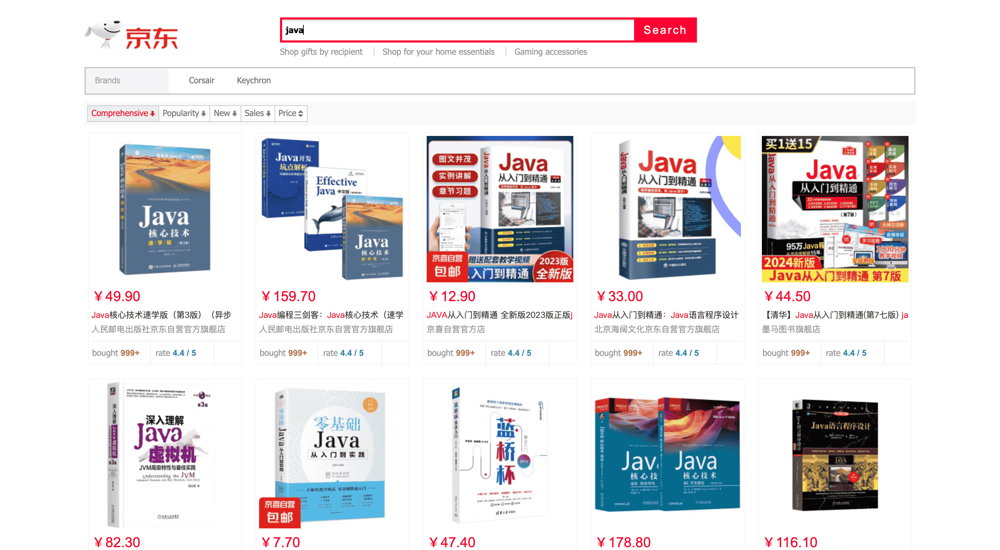

# Best Practice for ElasticSearch

This is a best practice project about ElasticSearch. Its main functions include crawling and parsing HTML documents from online shopping malls, storing the data in ElasticSearch and highlighting the product information queried from ElasticSearch on the user interface.

## Frameworks used

Spring Boot, Thymeleaf, ElasticSearch, Axios, jQuery, etc.

## Details

- **Data acquisition and import:** After obtaining the user's input keywords, use the [Jsoup](https://jsoup.org/) tool to retrieve the HTML document from [JD.COM](https://global.jd.com/), then parse the data based on the HTML structure, and finally batch insert the data into ElasticSearch.
- **Data query and display:** Through the advanced search function of ElasticSearch, perform highlighted paged queries based on the user's input keywords, and use the template engine to render the data to the HTTP response, and finally display it on the user interface.

## Captures

